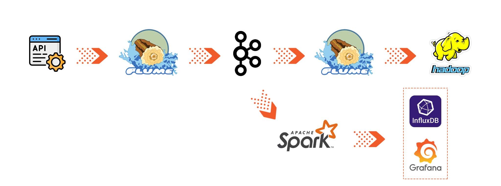
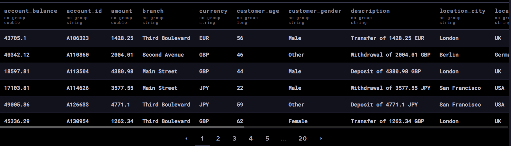
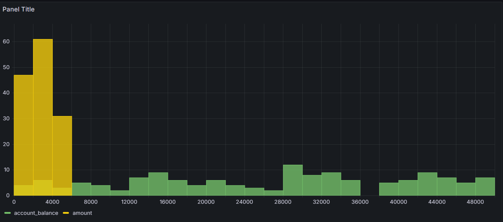

# Big Data Engineering Project: Real-Time Finance Data Processing

## Overview
This project demonstrates a data engineering pipeline designed to collect, process, store, and visualize financial transaction data in real-time. The pipeline leverages Hadoop, Kafka, Flume, Spark, and cloud databases to handle streaming data with a focus on scalability, analysis, and visualization.

## Pipeline Summary

1. **Data Collection**: A Python script generates synthetic financial transaction data, saving it locally as JSON files.
2. **Ingestion**: Apache Flume ingests data from the local filesystem, forwarding it to Apache Kafka.
3. **Storage & Processing**:
   - Flume transfers a copy of the data from Kafka (acting as a consumer) to HDFS.
   - Spark processes data from Kafka in real time, sending processed data to InfluxDB.
4. **Storage in Cloud**: Processed data is stored in InfluxDB on the cloud for analytics.
5. **Analysis & Visualization**: Grafana Cloud visualizes the stored data, creating real-time insights and dashboards for monitoring transaction metrics and trends.



## Project Architecture

1. **Data Generator Script**: This Python script creates random transaction data and saves it as JSON files.
2. **Apache Flume**: 
   - Transfers data from JSON files to Kafka and then forwards it to HDFS.
   - Manages data ingestion from Kafka to ensure reliable data delivery.
3. **Apache Kafka**: Manages the streaming data, buffering events between producers and consumers.
4. **Apache Spark**: Consumes data from Kafka for real-time data processing and transformation.
5. **InfluxDB**: Stores processed data in a cloud database for time-series analytics.
6. **Grafana Cloud**: Provides a platform for real-time visualization, allowing interactive dashboards to monitor transaction metrics.

---

## Prerequisites

- **CentOS 6.5 (or any compatible environment)**
- **Hadoop** for distributed storage
- **Apache Flume** for data ingestion
- **Apache Kafka** for data streaming
- **Apache Spark** for real-time processing
- **InfluxDB Cloud** for cloud-based storage
- **Grafana Cloud** for visualization

Ensure that all components are installed and configured according to the project setup and environment.

---

## Project Setup

### 1. Data Generator Script
The script generates synthetic financial transaction data, storing it in a specified local directory.

- **Script File**: 

​	

```python
import json
import time
import random
from datetime import datetime
import os

output_dir = '/home/bigdata/Desktop/flumetst/'

timestamp = datetime.now().strftime("%Y%m%d_%H%M%S")
output_file = os.path.join(output_dir, f'finance_transactions_{timestamp}.json')


# Function to generate random finance transaction data
def generate_transaction_data():
    transaction_id = f"T{random.randint(100000, 999999)}"
    account_id = f"A{random.randint(100000, 999999)}"
    transaction_type = random.choice(["deposit", "withdrawal", "transfer", "payment"])
    amount = round(random.uniform(100.0, 5000.0), 2)
    currency = random.choice(["USD", "EUR", "JPY", "GBP"])
    transaction_date = datetime.utcnow().isoformat() + "Z"
    description = f"{transaction_type.capitalize()} of {amount} {currency}"
    branch = random.choice(["Main Street", "Second Avenue", "Third Boulevard", "Fourth Square"])
    
    # New columns
    customer_age = random.randint(18, 80)  # Age of the customer
    customer_gender = random.choice(["Male", "Female", "Other"])
    account_balance = round(random.uniform(1000.0, 50000.0), 2)  # Current account balance
    transaction_channel = random.choice(["online", "ATM", "branch", "mobile"])
    transaction_status = random.choice(["completed", "pending", "failed"])
    merchant_id = f"M{random.randint(1000, 9999)}" if transaction_type in ["payment", "transfer"] else None
    location_city = random.choice(["New York", "San Francisco", "London", "Tokyo", "Berlin"])
    location_country = {"New York": "USA", "San Francisco": "USA", "London": "UK", "Tokyo": "Japan", "Berlin": "Germany"}[location_city]

    return {
        "transaction_id": transaction_id,
        "account_id": account_id,
        "transaction_type": transaction_type,
        "amount": amount,
        "currency": currency,
        "transaction_date": transaction_date,
        "description": description,
        "branch": branch,
        "customer_age": customer_age,
        "customer_gender": customer_gender,
        "account_balance": account_balance,
        "transaction_channel": transaction_channel,
        "transaction_status": transaction_status,
        "merchant_id": merchant_id,
        "location_city": location_city,
        "location_country": location_country
    }

# Create the directory if it doesn't exist
os.makedirs(os.path.dirname(output_file), exist_ok=True)


# Stream data indefinitely
try:
    while True:
        transaction_data = generate_transaction_data()
        print(f"Generating transaction: {transaction_data}")
        
        # File to save transaction data
        timestamp = datetime.now().strftime("%Y%m%d_%H%M%S")
        output_file = os.path.join(output_dir, f'finance_transactions_{timestamp}.json')
        
        # Create the file if it doesn't exist
        if not os.path.isfile(output_file):
            open(output_file, 'w').close()  # Create an empty file
        
        # Save data to file
        with open(output_file, 'a') as f:
            f.write(json.dumps(transaction_data) + '\n')  # Append JSON object to the file

        time.sleep(1)  # Wait for 1 second before generating the next transaction

except KeyboardInterrupt:
    print("Stopped generating transactions.")

```


### 2. Configure Flume

#### Configuration 1: File Source to Kafka Sink
This configuration reads JSON files generated by the Python script and sends data to a Kafka topic.

- **Configuration File**: `flumekafkaAgent.conf`

  ```
  agent.sources = src_1
  agent.sinks = kafka_sink
  agent.channels = mem_channel
  
  agent.sources.src_1.type = spooldir
  agent.sources.src_1.channels = mem_channel
  agent.sources.src_1.spoolDir = /home/bigdata/Desktop/flumetst
  agent.sources.src_1.fileHeader = true
  
  agent.channels.mem_channel.type = memory
  agent.channels.mem_channel.capacity = 10000
  agent.channels.mem_channel.transactionCapacity = 10000
  
  agent.sinks.kafka_sink.type = org.apache.flume.sink.kafka.KafkaSink
  agent.sinks.kafka_sink.channel = mem_channel
  agent.sinks.kafka_sink.kafka.topic = finance
  agent.sinks.kafka_sink.kafka.bootstrap.servers = localhost:9092
  ```

  

#### Configuration 2: Kafka Source to HDFS Sink
This configuration reads data from the Kafka topic and writes it to HDFS.

- **Configuration File**: `kafka-flume-hdfs.conf`

```
agent.sources = source1
agent.sinks = k1
agent.channels = mem_channel

agent.sources.source1.type = org.apache.flume.source.kafka.KafkaSource
agent.sources.source1.channels = mem_channel
agent.sources.source1.batchSize = 5000
agent.sources.source1.batchDurationMillis = 2000
agent.sources.source1.kafka.bootstrap.servers = localhost:9092
agent.sources.source1.kafka.topics = weather

agent.channels.mem_channel.type = memory
agent.channels.mem_channel.capacity = 1000
agent.channels.mem_channel.transactionCapacity = 100

agent.sinks.k1.type = hdfs
agent.sinks.k1.channel = mem_channel
agent.sinks.k1.hdfs.path = /flume
agent.sinks.k1.hdfs.round = true
agent.sinks.k1.hdfs.roundValue = 10
agent.sinks.k1.hdfs.roundUnit = minute
agent.sinks.k1.hdfs.fileType=DataStream

```


### 3. Configure Kafka
Create a Kafka topic to receive data from Flume:

```
kafka-topics.sh --create --topic finance --bootstrap-server localhost:9092
```


### 4. Configure Spark

Use Spark to consume data from Kafka, process it, and send results to InfluxDB.

- **Spark Script**: 

  ```python
  from pyspark.sql import SparkSession
  from pyspark.sql import Row
  from kafka import KafkaConsumer
  import json
  from influxdb_client import InfluxDBClient, Point
  from influxdb_client.client.write_api import SYNCHRONOUS
  import os
  
  # Initialize Spark session
  spark = SparkSession.builder \
      .appName("KafkaToSparkFinanceTransactions") \
      .getOrCreate()
  
  # InfluxDB configuration
  influxdb_url = "https://us-east-1-1.aws.cloud2.influxdata.com"  # Replace with your region's URL
  token = "<your-influxdb-token>"  # Replace with your token
  org = "*****"  # Replace with your organization
  bucket = "kafka-finance"  # Replace with your bucket name
  
  # Initialize InfluxDB client
  client = InfluxDBClient(url=influxdb_url, token=token, org=org)
  write_api = client.write_api(write_options=SYNCHRONOUS)
  
  # Define schema for finance transaction logs
  schema = ["transaction_id", "account_id", "transaction_type", "amount", "currency", 
            "transaction_date", "description", "branch", "customer_age", "customer_gender",
            "account_balance", "transaction_channel", "transaction_status", "merchant_id", 
            "location_city", "location_country"]
  
  # Initialize Kafka consumer
  consumer = KafkaConsumer(
      'finance',
      bootstrap_servers='localhost:9092',
      auto_offset_reset='latest',
      value_deserializer=lambda x: json.loads(x.decode('utf-8'))  # Deserialize JSON messages
  )
  
  # List to accumulate rows and other configurations
  rows = []
  batch_size = 20  # Define the size of each batch
  max_messages = 500  # Total number of messages to process before finishing
  message_count = 0  # Counter for processed messages
  
  # Process Kafka messages
  for message in consumer:
      data = message.value  # Use the deserialized JSON directly
  
      # Create a Row object for Spark
      row = Row(
          transaction_id=data['transaction_id'], 
          account_id=data['account_id'], 
          transaction_type=data['transaction_type'], 
          amount=float(data['amount']), 
          currency=data['currency'], 
          transaction_date=data['transaction_date'],  # Expected to be in ISO format
          description=data['description'], 
          branch=data['branch'],  # <- Added missing comma here
          customer_age=data['customer_age'],
          customer_gender=data['customer_gender'],
          account_balance=data['account_balance'],
          transaction_channel=data['transaction_channel'],
          transaction_status=data['transaction_status'],
          merchant_id=data['merchant_id'],
          location_city=data['location_city'],
          location_country=data['location_country']
      )
      
      rows.append(row)
      message_count += 1
  
      # Process batch if the batch size is reached
      if len(rows) == batch_size:
          # Create DataFrame and show data for this batch
          df = spark.createDataFrame(rows, schema=schema)
          df.show()
  
          # Write data to InfluxDB
          for row in df.collect():
              point = Point("finance_transaction_data") \
                  .tag("transaction_id", str(row.transaction_id)) \
                  .tag("account_id", str(row.account_id)) \
                  .tag("transaction_type", str(row.transaction_type)) \
                  .tag("currency", str(row.currency)) \
                  .tag("branch", str(row.branch)) \
                  .field("amount", float(row.amount)) \
                  .field("transaction_date", str(row.transaction_date)) \
                  .field("description", str(row.description)) \
                  .field("customer_age", int(row.customer_age)) \
                  .field("customer_gender", str(row.customer_gender)) \
                  .field("account_balance", float(row.account_balance)) \
                  .field("transaction_channel", str(row.transaction_channel)) \
                  .field("transaction_status", str(row.transaction_status)) \
                  .field("merchant_id", str(row.merchant_id)) \
                  .field("location_city", str(row.location_city)) \
                  .field("location_country", str(row.location_country))
              write_api.write(bucket=bucket, org=org, record=point)
              
          # Reset the rows list for the next batch
          rows = []
  
      # Stop processing if max_messages limit is reached
      if message_count >= max_messages:
          print(f"Processed {max_messages} messages. Stopping.")
          break
  
  # Process any remaining rows
  if rows:
      df = spark.createDataFrame(rows, schema=schema)
      df.show()
  
      for row in df.collect():
          point = Point("finance_transaction_data") \
              .tag("transaction_id", str(row.transaction_id)) \
              .tag("account_id", str(row.account_id)) \
              .tag("transaction_type", str(row.transaction_type)) \
              .tag("currency", str(row.currency)) \
              .tag("branch", str(row.branch)) \
              .field("amount", float(row.amount)) \
              .field("transaction_date", str(row.transaction_date)) \
              .field("description", str(row.description)) \
              .field("customer_age", int(row.customer_age)) \
              .field("customer_gender", str(row.customer_gender)) \
              .field("account_balance", float(row.account_balance)) \
              .field("transaction_channel", str(row.transaction_channel)) \
              .field("transaction_status", str(row.transaction_status)) \
              .field("merchant_id", str(row.merchant_id)) \
              .field("location_city", str(row.location_city)) \
              .field("location_country", str(row.location_country))
          write_api.write(bucket=bucket, org=org, record=point)
  
  # Clean up
  consumer.close()
  client.close()
  
  ```

  

Replace placeholders with your InfluxDB connection details in the script:
- influxdb_url
- org
- bucket
- token

### 5. Configure InfluxDB Cloud
Set up InfluxDB Cloud to store processed data from Spark. Follow the [InfluxDB Cloud setup guide](https://www.influxdata.com/) to configure:

- Organization ID
- Bucket
- API Token
- API Endpoint



### 6. Configure Grafana Cloud

Sign up on Grafana Cloud, create a dashboard, and add InfluxDB as a data source:

1. In Grafana, go to **Data Sources** > **Add Data Source** > select **InfluxDB**.
2. Configure with:
   - **URL**: Your InfluxDB Cloud endpoint
   - **Bucket**: InfluxDB bucket name
   - **Token**: InfluxDB API token
   
   

---

## Usage

1. **Start Required Services**
   - HDFS and YARN: 
   
     ```bash
     start-all.sh
     ```
   - Kafka and Zookeeper:
     
     ```bash
     cd $KAFKA_HOME
     ```
     
     ```bash
     bin/zookeeper-server-start.sh config/zookeeper.properties
     ```
     
     ```bash
     bin/kafka-server-start.sh config/server.properties
     ```
     
     **Run Data Generator**
     
     ```bash
     python3 /<your-path>/Generator.py
     ```
   
3. **Start Flume Agents**
   
   ```bash
   $FLUME_HOME/bin/flume-ng agent --conf conf --conf-file $FLUME_HOME/conf/flumekafkaAgent.conf --name agent -Dflume.root.logger=DEBUG,console
   ```

   ```bash
   $FLUME_HOME/bin/flume-ng agent --conf conf --conf-file $FLUME_HOME/conf/kafka-flume-hdfs.conf --name agent -Dflume.root.logger=DEBUG,console
   ```
   
4. **Run Spark Job**
   
   ```bash
   python3 /<your-path>/upload.py
   ```
   
   
   
5. **Monitor Data in Grafana**
   
   - Access your Grafana dashboard to view real-time insights and visualizations based on the financial transaction data.

---

## Analysis & Visualization

Grafana dashboards provide real-time monitoring of financial transactions, enabling you to track key metrics like transaction amount, transaction status, and customer demographics.

### Key Features of Grafana Dashboard
- **Dynamic Dashboards**: Visualize time-series data to monitor trends and identify anomalies.
- **Real-Time Alerts**: Set thresholds and alerts to notify you of significant data changes.

---

## Project Status and Future Enhancements

### Current Status
The pipeline is fully operational, supporting real-time data ingestion, processing, and visualization.

### Future Work
- **Optimize Data Processing**: Implement advanced data transformation techniques in Spark for efficiency.
- **Expand Data Sources**: Integrate additional APIs or data sources.
- **Extend Storage Options**: Consider adding Elasticsearch or other data warehouses for more diverse analytics.

